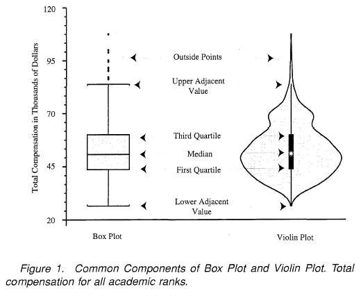

# EDA-on-Transfusion-Dataset
Exploratory Data Analysis on a small Transfusion Dataset of the year 2017

**Added some new explanations**



Simply put, ViolinPlot is the combination of a box-plot and a kernel-density-plot. It explains the 5 statistics that a box plot reveals and more with the kdplot

```def plot_comparison(x, title):
    fig, ax = plt.subplots(3, 1, sharex=True)
    sns.distplot(x, ax=ax[0])
    ax[0].set_title('Histogram + KDE')
    sns.boxplot(x, ax=ax[1])
    ax[1].set_title('Boxplot')
    sns.violinplot(x, ax=ax[2])
    ax[2].set_title('Violin plot')
    fig.suptitle(title, fontsize=16)
    plt.show()
    
sample_gaussian = np.random.normal(size=N)
plot_comparison(sample_gaussian, 'Standard Normal Distribution')
 ```
 
